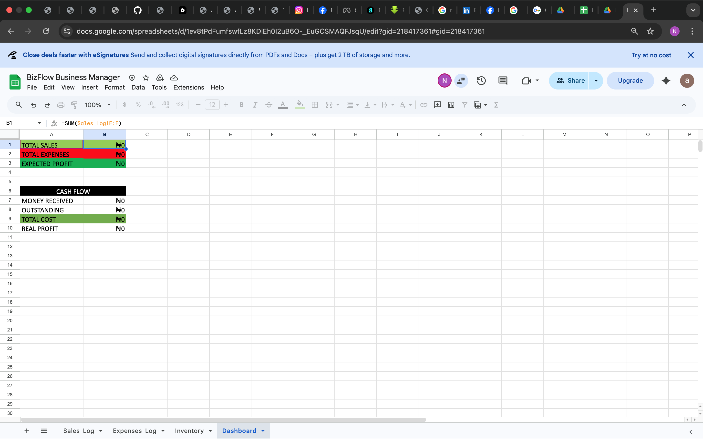
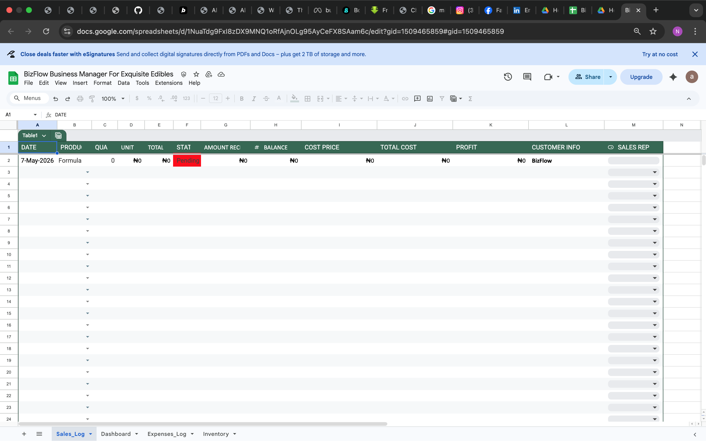
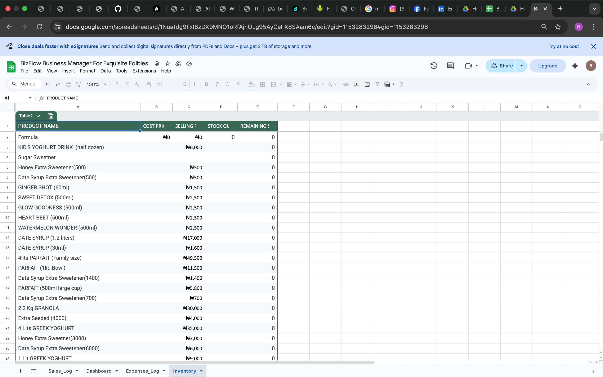

# bizflow-business-manager
A smart business management and inventory tracking system built to help small businesses manage products, sales, stock levels, and operations efficiently using automated spreadsheets and workflow systems.

---

# Overview

BizFlow helps businesses:

- Manage inventory
- Track sales
- Monitor remaining stock
- Organize operations
- Reduce manual errors

The system uses spreadsheet automation and structured workflows to simplify daily business management.

---

# Features

## Inventory Management
- Product tracking
- Price management
- Quantity monitoring
- Automatic stock updates

## Sales Tracking
- Record sales
- Monitor inventory movement
- Organized transaction records

## Automation
- Formula-driven calculations
- Automatic stock deduction
- Reduced manual work

## Collaboration
- Google Sheet collaboration
- Shared business workflow
- Controlled editing access

---

# Tools Used

- Microsoft Excel
- Google Sheets
- Spreadsheet Automation
- Excel Formulas
- Conditional Formatting
- Data Validation

---

# Project Preview

## Inventory Dashboard


## Sales Tracker


## Inventory Management


---

# Folder Structure

```txt
bizflow-business-manager/
│
├── README.md
├── screenshots/
│   ├── dashboard.png
│   ├── inventory.png
│   └── sales.png
│
└── Access
```

---

# Business Problem

Small businesses often struggle with:
- Manual stock tracking
- Inventory errors
- Poor organization
- Difficult collaboration
- Missing sales records

BizFlow solves these problems through automation and structured workflows.

---

# Future Improvements

- Web Application Version
- Analytics Dashboard
- Customer Management
- Mobile Support
- Role-Based Access

---

# Author

## Emmanuel Sunday Umanah (AlpHaNuel)

# Access the Project

BizFlow operates through a protected Google Sheets workflow system.

To maintain system integrity and prevent unauthorized duplication, the main operational file is not publicly downloadable.

Request access here:

[BizFlow Access Request](https://docs.google.com/spreadsheets/d/1NuaTdg9FxI8zDX9MNQ1oRfAjnOLg95AyCeFX8SAam6c/edit?usp=sharing)

Access permissions are controlled manually.
